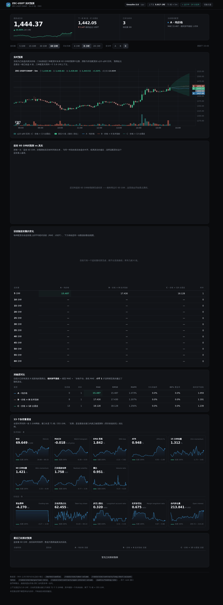
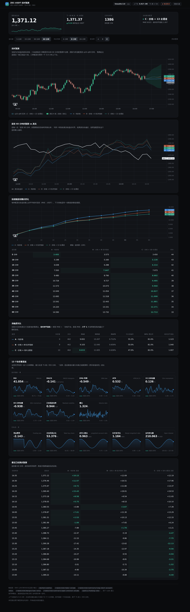

# ZEC-USDT 实时预测 · TimesFM 3.0

用 TimesFM 3.0 对 OKX `ZEC-USDT-SWAP` 做滚动实时预测，并把每一次预测和**后来真正发生的价格**
逐点对齐打分。三种协变量配置并排跑在同一个上下文窗口上，网页实时展示预测曲线、置信区间、
13 个协变量通道，以及随时间累积的准确度对比。

```
python -m zecfm            # http://127.0.0.1:8000
```



> 上图是**实盘截图**：真实的 ZEC-USDT-SWAP 行情，服务刚启动几分钟，所以准确度面板还基本是空的 ——
> 这正是冷启动应有的样子（下面「没有回填」一节解释了为什么）。
>
> 下图是**回放数据**（确定性合成行情跑满 45 根 K 线，轮询已停止，所以状态灯是「数据陈旧」），
> 用来看各面板填满之后长什么样。
>
> <details><summary>展开：面板填满后的样子</summary>
>
> 
>
> </details>

### 界面

深浅两套主题各自独立配色（不是简单反色），默认跟随系统，右上角可手动切换，选择记在
`localStorage`。三种配置在全站固定用同一组颜色——A 蓝、B 橙、C 绿——这组颜色通过了
色盲可分辨性校验（最差相邻对 CVD ΔE 9.2 / 9.4，普通视觉 ΔE 20.9 / 24.0），并且在两种
主题的表面色上都复核过对比度。颜色跟着配置走，不跟着排名走：筛掉一条线不会让其余的
换色。

配色之外的可读性保障：每条预测线在右端都有直接标注（A / B / C），图例常驻，所有图表
的数值都能在下方表格里读到——浅色模式下绿色对比度低于 3:1，靠的就是这两层兜底。
图表悬停有十字准星和一次列出所有系列的浮层；深色下的网格线只比背景高一档，不跟数据线抢。

### 图表

价格图用的是 TradingView 官方开源的
**[Lightweight Charts](https://github.com/tradingview/lightweight-charts)**（Apache-2.0），
而不是通用图表库 —— 真实的红绿 K 线、磁吸十字准星、右侧价格轴上的最后值徽章、
时间轴刻度，都来自画 tradingview.com 的同一套代码，所以图表读起来就是交易员习惯的样子。

三张图的分工：

| 图 | 用的组件 | 说明 |
|---|---|---|
| 实时预测 | `createChart` + `CandlestickSeries` | 真实 K 线 + 三条预测虚线 |
| 提前 N 分钟 vs 真实 | `createChart` + `LineSeries` | 真实线 vs 三条预测线 |
| 误差随提前量 | `createOptionsChart` | 横轴是提前量不是时钟，所以用库自带的**数值横轴**图，而不是把时间轴硬掰成别的东西 |

盘面该有的都在：真实红绿 K 线、底部**成交量柱**（涨绿跌红，独立的叠加价格轴，占底部 20%，
不干扰主价格轴）、左上角跟随十字光标的 **OHLC 信息栏**（开 / 高 / 低 / 收 / 涨跌幅 / 成交额，
光标移开时回落到最新一根）。

两处需要说明的实现细节：

- **q10–q90 置信带**是一个**自定义系列**（`addCustomSeries`），在两条分位数边界之间填一条
  路径。没有用「叠两层 area、下层刷成背景色」这个常见技巧，因为那样填充并不真的透明 ——
  网格线会被盖掉，q10 以下的内容也会被糊住。
- **每条预测线的直接标注**（A / B / C）不是手画上去的，而是 series 的 `title` 选项 ——
  它会出现在价格轴的最后值徽章里，这正是 TradingView 自己的做法。浅色模式下绿色对比度
  低于 3:1，靠的就是这个标注加下方表格兜底。
- 图表**只创建一次**，之后每次轮询只 `setData`。每 15 秒重建一遍会把读者的缩放和平移
  全部丢掉，而那恰恰是可交互价格图的意义所在。
- 横轴单位：数值横轴会自己格式化刻度、不走 `tickMarkFormatter`，所以「误差随提前量」那张
  图的横轴是裸数字，单位写在图例里。

图表库是**本地打包**的（`static/vendor/`），页面没有任何第三方 CDN 依赖；即使图表完全
没加载出来，表格和通道面板也照常渲染。窄屏（手机）下 hero 区堆叠为单列，宽表格在自己的
容器里横向滚动，页面本身不会横向溢出。

TradingView 的归属 logo 保留在图表左下角。

---

## 设计

### 目标与窗口

| 项 | 取值 | 说明 |
|---|---|---|
| 标的 | `ZEC-USDT-SWAP` | OKX 永续合约 |
| K 线 | 5 分钟 | |
| 上下文 | **71 根 = 355 分钟 ≈ 5.92 小时** | 三种配置统一 |
| 预测步长 | 12 根 = 60 分钟 | `--horizon` 可调 |
| 预测频率 | 每收盘一根 5 分钟 K 线一次 | 数据每 20 秒刷新一次 |

**为什么是 5.9 小时。** OKX 的主动买卖量比接口
（`/api/v5/rubik/stat/taker-volume`，`period=5m`）只保留 **72 个 5 分钟桶**，
而其中最新的那个永远还在累积中。丢掉未收敛的那个桶之后剩 **71 个已收盘桶 = 355 分钟
= 5.9167 小时**，这是 13 个通道里最短的一条历史，于是它决定了所有配置的上下文长度。
把三种配置钉在同一个窗口上，准确度表才是一次干净的消融实验。

### 13 个协变量通道

全部作为 **past-only covariates** 传给 TimesFM 3.0（未来值不可知），对齐到同一条 5 分钟网格。

**技术指标 · 8**（只由 K 线导出）

| 通道 | 定义 |
|---|---|
| RSI | Wilder RSI(14) |
| MACD | (EMA12−EMA26) − DEA9，除以收盘价归一为百分比 |
| EMA 乖离 | (close − EMA20) / EMA20 × 100 |
| ATR | Wilder ATR(14) / close × 100 |
| 15 分钟动量 | close_t / close_{t−3} − 1 |
| 60 分钟动量 | close_t / close_{t−12} − 1 |
| 已实现波动率 | 12 根对数收益率标准差 × √12，折算小时波动率 |
| 量比 | 当根成交额 / **前** 12 根成交额均值 |

MACD、ATR 都除以了价格：ZEC 一天之内能走十几个百分点，不做归一的话通道值会跟着价格
水平一起漂移，模型学到的是价格水平而不是形态。

**衍生品 · 5**

| 通道 | 接口 | 单位 |
|---|---|---|
| 资金费率 | `/api/v5/public/funding-rate` + `-history` | 基点 |
| 主动买卖占比 | `/api/v5/rubik/stat/taker-volume` | % （买 / (买+卖)） |
| 多空人数比 | `/api/v5/rubik/stat/contracts/long-short-account-ratio` | 比值 |
| 杠杆多空比 | `/api/v5/rubik/stat/margin/loan-ratio` | 比值 |
| 合约持仓量 | `/api/v5/rubik/stat/contracts/open-interest-volume` | 百万美元 |

四个 rubik 接口按**币种**聚合（`ccy=ZEC`），描述的是全市场 ZEC 合约而不是单一合约 —
这是 OKX 的口径，网页的通道面板上也照此标注。

资金费率每 8 小时结算一次，在 5.9 小时窗口里本来只是一条阶梯。服务每次轮询都会把当期
费率采样存进 SQLite，跑一段时间之后这个通道就带上了真实的期内变化；冷启动时回落到
结算历史的阶梯值。

### 三种配置

| | 配置 | 协变量 | 用途 |
|---|---|---|---|
| A | 纯价格 | 0 | 零协变量基线 |
| B | 价格 + 8 技术指标 | 8 | 只用 K 线自身能算出的信息 |
| C | 价格 + 13 全通道 | 13 | 完整配置 |

B − A 分离出技术指标的增益，C − B 分离出衍生品数据的增益。

> **三种配置各自单独调用一次 `predict_batch`，这是必须的。** TimesFM 会把一个 batch 里的
> 协变量堆叠成一个数组，通道数不同（0 / 8 / 13）的查询根本堆不起来；更隐蔽的是，如果在
> 一个含协变量的 batch 里传 `None`，模型拿到的是**全零协变量块**而不是「没有协变量」。
> 那样 A 就不再是干净的基线了。

---

## 打分：预测怎么和真实数据对齐

每次预测在产生的当下就写进 SQLite —— 此时它要预测的那些 K 线**还不存在**。
之后 K 线陆续收盘，打分逻辑把预测点和**后到的**真实 K 线按目标时间戳 join 起来。
所以准确度表在结构上就是样本外的，不是靠约定。

| 指标 | 含义 |
|---|---|
| MAE / RMSE / MAPE | 中位数预测的误差 |
| 方向准确率 | 预测涨跌方向与真实一致的比例（真实没动的点不计入） |
| 80% 覆盖率 | 真实值落在 q10–q90 区间内的比例，理想值 80% |
| **相对持平基线** | 模型 MAE ÷「价格不动」基线 MAE |

最后一列是重点。日内加密价格接近随机游走，「下一小时价格不变」是一个很难打败的基线。
**只有这个数小于 1，模型才真的赢了。** 网页把它放在每个头条数字旁边而不是藏起来。

### 没有回填，三种配置一起从零开始

想给过去某个时刻 T 做预测，就需要截止到 T 的 5.9 小时主动买卖量比历史 —— 而接口只保留
截止到**此刻**的 5.9 小时。所以配置 C 能构造的最早起点就是当下。
只回填 A 和 B 会让它们攒下几百个样本而 C 是零，对比表也就失去意义。
三种配置因此一律从空表开始，随服务运行一起累积。

刚启动时准确度表是空的，第一条「提前 60 分钟」的记录会在运行约 1 小时后出现。

---

## 安装与运行

TimesFM 3.0 本体从仓库根目录安装，这个应用只多几个依赖：

```bash
# 仓库根目录
pip install -e '.[torch]'

# 本目录
pip install -r requirements.txt
python -m zecfm
```

TimesFM 3.0 权重需要从 Hugging Face 拉取
（`google/timesfm-3.0-pytorch`，约 1.3 GB，首次启动自动下载）。
**权重使用 `timesfm-non-commercial-license-v1.0`，仅限非商业、非生产用途** ——
这个项目是模型评估演示，不是交易系统。

### 参数

```
--host 127.0.0.1     --port 8000
--db zecfm.db        SQLite 路径；删掉即清空历史战绩
--engine timesfm     或 random-walk（开发占位，不是预测结果，网页会打红色横幅）
--checkpoint ...     默认 google/timesfm-3.0-pytorch
--device cuda        默认自动选择
--horizon 12         预测多少根 5 分钟 K 线
--poll 20            行情刷新间隔（秒）
```

拿不到权重时可以用 `--engine random-walk` 把整条链路和网页跑起来。它输出的是
「价格不动 + √h 展开的区间」，**不是** TimesFM 的预测，网页顶部会一直挂着红色告警。
引擎名也会写进每一行预测记录，所以占位数据不会混进真实战绩里。

### 地区限制

OKX 接口在部分地区/机房不可达。程序会在网页顶部显示轮询错误并自动退避重试，
但如果是 451 之类的地区封锁，需要换一个能访问 OKX 的网络环境。

---

## HTTP 接口

| 路径 | 说明 |
|---|---|
| `GET /` | 网页 |
| `GET /api/state?bars=96&lead=12` | 网页用的全量状态（行情、三条实时预测、准确度、通道、结算记录） |
| `GET /api/metrics` | 各配置准确度，含按提前量的分解 |
| `GET /api/status` | 引擎、窗口、轮询、各通道实测覆盖率 |
| `GET /api/definition` | 13 个通道与 3 种配置的静态定义 |
| `GET /api/healthz` | 连续失败 5 次以上返回 503 |

---

## 结构

```
zecfm/
  config.py       窗口、13 个通道、3 种配置的唯一定义
  okx.py          OKX v5 异步客户端（6 个公共接口，带重试）
  features.py     指标计算 + 网格对齐（纯 numpy，可离线测试）
  forecaster.py   TimesFM 3.0 封装 + 占位引擎
  store.py        SQLite 持久化与打分
  service.py      轮询 → 预测 → 结算 循环
  app.py          FastAPI
static/index.html 单页仪表盘（TradingView Lightweight Charts）
static/vendor/     本地打包的 lightweight-charts（Apache-2.0）
tests/            50 个单元测试，不需要网络和权重
```

```bash
pytest tests/ -q
```

测试里有两条是防回归的关键：`test_channels_are_not_affected_by_later_bars`
（追加新 K 线不得改写历史通道值）和
`test_incomplete_derivative_bucket_never_reaches_the_grid`
（未收敛的衍生品桶不得进入网格）。这两条一旦破了，准确度表就会因为前视偏差而虚高。

---

本页面仅用于模型评估与演示，不构成任何投资建议。
